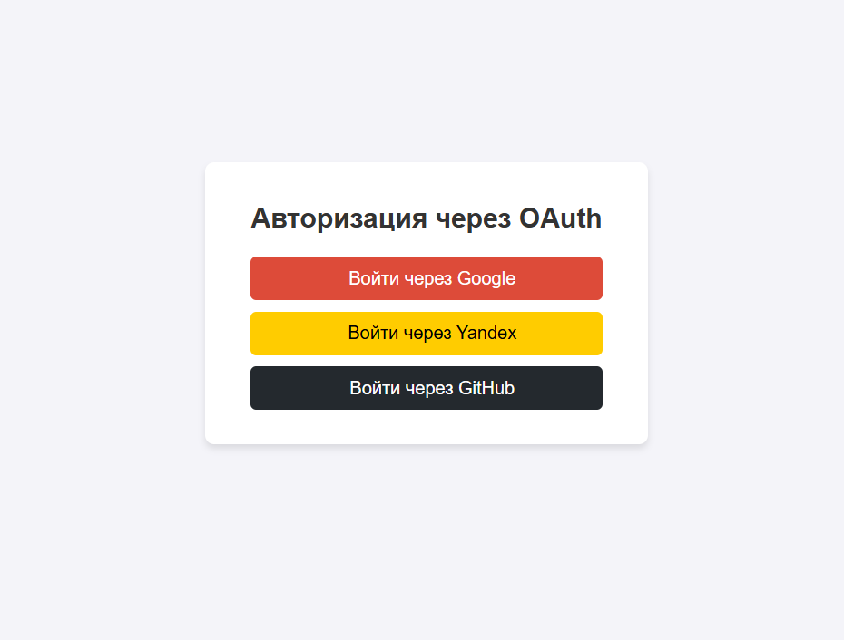
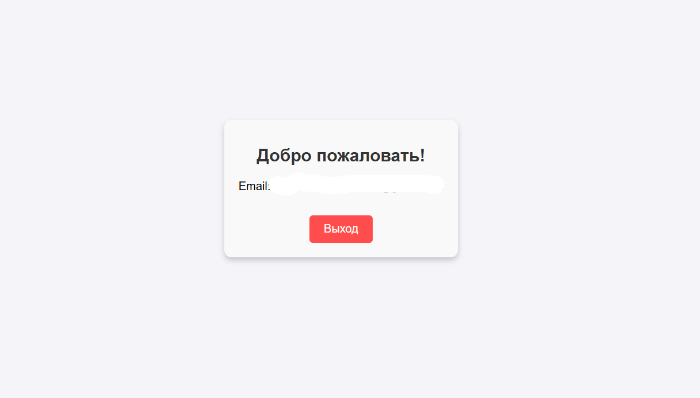

<link rel="stylesheet" href="https://cdnjs.cloudflare.com/ajax/libs/font-awesome/6.0.0-beta3/css/all.min.css">

# Auth Service

Сервис авторизации через OAuth через:

-  Google
-  Yandex
-  GitHub

## Инструкция по подключению сервисов к OAuth

### 1. Google OAuth
Для подключения Google OAuth выполните следующие шаги:

1. Перейдите в [Google Cloud Console](https://console.cloud.google.com/).
2. Создайте новый проект или выберите существующий.
3. В разделе **APIs & Services > Credentials** нажмите **Create Credentials > OAuth client ID**.
4. Настройте тип приложения:
   - **Web application**: если ваш сервис работает через браузер.
   - **Desktop application**: если ваш сервис работает локально.
5. Укажите разрешенные URI для перенаправления (Redirect URIs), `http://localhost:5173/auth/google`.
6. После создания клиента вы получите **Client ID** и **Client Secret**. Используйте их для настройки OAuth в вашем приложении.
7. Подробнее: [Google OAuth Documentation](https://developers.google.com/identity/protocols/oauth2).

---

### 2. Yandex OAuth
Для подключения Yandex OAuth выполните следующие шаги:

1. Перейдите в [Yandex OAuth](https://oauth.yandex.com/).
2. Нажмите **Зарегистрировать новое приложение**.
3. Заполните форму:
   - Укажите название приложения.
   - Выберите платформу (например, Web).
   - Укажите Callback URL (`http://localhost:5173/auth/yandex`).
4. После регистрации вы получите **Client ID** и **Client Secret**.
5. Используйте эти данные для настройки OAuth в вашем приложении.
6. Подробнее: [Yandex OAuth Documentation](https://yandex.ru/dev/oauth/doc/dg/concepts/about.html).

---

### 3. GitHub OAuth
Для подключения GitHub OAuth выполните следующие шаги:

1. Перейдите в [GitHub Developer Settings](https://github.com/settings/developers).
2. Нажмите **New OAuth App**.
3. Заполните форму:
   - **Application name**: название вашего приложения.
   - **Homepage URL**: URL вашей домашней страницы (например: `http://localhost:5173`).
   - **Authorization callback URL**: URL для перенаправления после авторизации (`http://localhost:5173/auth/github`).
4. После создания приложения вы получите **Client ID** и **Client Secret**.
5. Используйте эти данные для настройки OAuth в вашем приложении.
6. Подробнее: [GitHub OAuth Documentation](https://docs.github.com/en/developers/apps/building-oauth-apps).

---

## Инструкция по запуску React-приложения на Vite:

Для запуска React-приложения на Vite выполните следующие шаги:

### 1. Установка Node.js:
Убедитесь, что у вас установлен Node.js. Проверьте версию, выполнив команду:
```bash
node -v
```

### 2. Установка зависимостей:

```bash
npm install
```

### 3. Создайте `.env` файл:

```bash
VITE_BASE_BACKEND_URL=http://localhost:8000/api
```

### 4. Запуск приложения:

```bash
npm run dev
```

## Приложение:


